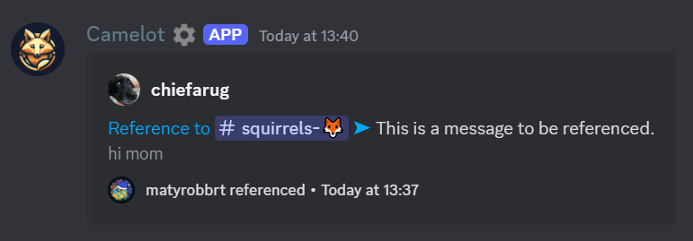

# Message Referencing Module
The message referencing module (id: `message-referencing`, configuration class: `MessageReferencing`) will automatically convert
Discord message links and dot-replies sent in chat to embeds.  
This way, a conversation that references to an older message can be linear, without needing to jump to other channels.

## Reference embed

The timestamp of the embed is the date at which the referenced message was sent.  
The footer displays the member that referenced the message, **unless** the author of the referenced message and the referencer are the same.

## Triggering
A message reference may be triggered in multiple ways:
- replying with just `.` or `^` to a message; the reply will be deleted unless it is a ping reply
- sending a message that starts with a Discord message link; your message will be deleted if it is just a message link

## Leaking private channels
By design, Camelot does **not** check the permissions of the member referencing a message, or the channel the reference is invoked in.
This means that a message from a private channel may be accidentally _or intentionally_ leaked if a link to it is sent in a public channel. 
To avoid it when not desired, you may surround the link the same way you suppress embeds (`<https://discord.com/....>`).

## Bot Permissions
The following bot permissions are required by this module: `Send Messages`, `Read Message History`, `Manage Messages`.
