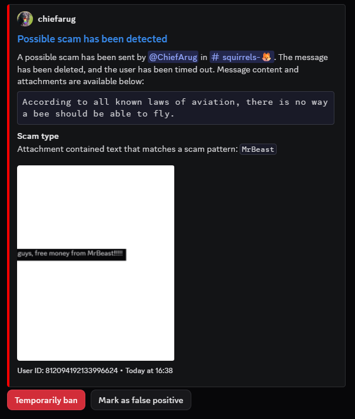

# Scam Detection Module
The scam detection module (id: `scam-detection`, configuration class: `ScamDetection`) has a few features that can be used to detect potential scams,
and temporarily time-out the user, pending moderator verification.

## Image content scam detection
The module can scan the content of attachments using Optical Character Recognition.
Image text will be tested against the provided regular expressions, and if a match is found, the message is flagged as a potential scam.


::: warning
While the module itself is light on memory and CPU consumption, OCR is not.  
For accuracy, all images sent in your server will be upscaled by a factor of 3 and then run through tesseract-ocr serially.  
This will incur a significant memory and processing cost that you should account for.
:::

## Bot Permissions
The following bot permissions are required by this module: `Kick Members`, `Ban Members`, `Time out Members`, `Manage Messages`.  
The following intents are required by this module: `Message content`.

This module does not require permanent data storage.

## Plug&Play Scam Detection
A Docker Compose file that deploys **only** OCR-based scam detection is available below.
You only need to configure the environment variables at the top of the file, and modify the memory and CPU limits as required.

```yml
# Plug&Play Docker Compose configuration for Camelot's OCR-based scam detection.
# For more information, visit https://camelot.rocks/modules/scam-detection.html

services:
  camelot:
    image: ghcr.io/neoforged/camelot:latest
    environment:
      # The token of your bot, obtained from the Discord Developer Portal
      BOT_TOKEN:
      # The ID of the channel in which to log potential scams
      SCAM_LOGGING_CHANNELS:
      # The regular expressions against which to test image text content. One per line. Use https://regex101.com/ to test your patterns.
      OCR_SCAM_PATTERNS: |
        (?i)example\spattern1
        another.*pattern

    # Update the limits below as you see fit
      JVM_OPTS: -Xmx4G
    deploy:
      resources:
        limits:
          cpus: 4
          memory: 4GB
 
    configs:
      - source: camelot.groovy
        target: /home/camelot/camelot.groovy

configs:
  camelot.groovy:
    content: |
      camelot {
          token = secret(env('BOT_TOKEN'))
      
          eachModule { enabled = false }
          module(ScamDetection) {
              enabled = true
          }
      
          guildConfiguration {
              forAnyGuild {
                  modules."scam-detection" = {
                      logging_channels = env('SCAM_LOGGING_CHANNELS').trim().split('[,\n]').collect {it.trim() as long}
      
                      image_scams = {
                          enabled = !(System.getenv('OCR_SCAM_PATTERNS') ?: '').isBlank()
                          patterns = System.getenv('OCR_SCAM_PATTERNS')?.trim()?.split('\n') ?: []
                      }
                  }
              }
          }
      }
```
::: info
If you intend to use more features of the bot or configure it through Discord, you will have to set it up normally (and persist its data storage folder).
:::
